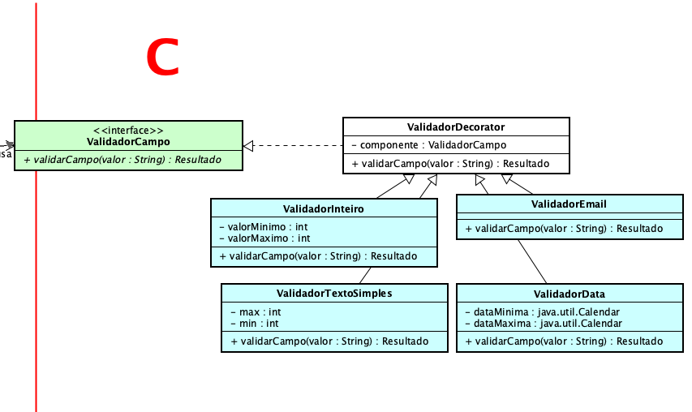
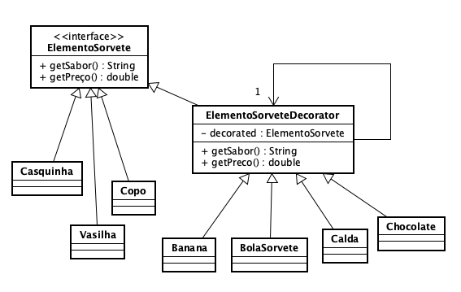

**Universidade Federal da Paraíba - UFPB** \
**Centro de Ciências Exatas e Educação - CCAE** \
**Departamento de Ciências Exatas - DCX**

**Professor:** [Rodrigo Rebouças de Almeida](http://rodrigor.dcx.ufpb.br)

# Atividade 10 - Padrão Decorator

- Implemente as classes descritas nos diagramas abaixo, de modo que os testes existentes na atividade passem.
  
  
